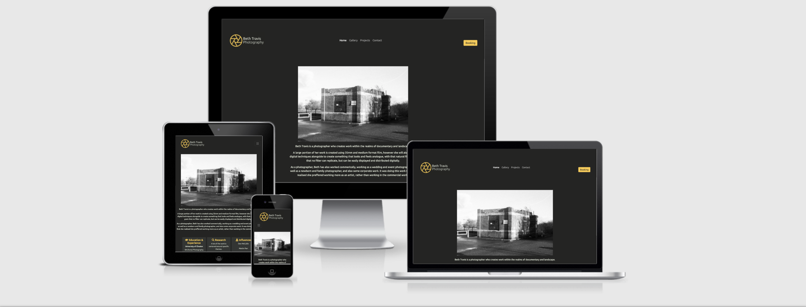

https://beth-t93.github.io/ci_ms1_btphotography/

## Project Goals
The aim of this project is to create a portfolio website to showcase my own photography work in a way that is both appealing and accessible across a range of devices and screen sizes.

## User Exerpinece (UX)
### User Goals
An easy to use website
A way to contact the photographer directly
Key details, such as contact details and location are easy to find
Easy to find examples of the photographers work and any projects they are working on
Information should be current and up to date

### Target Audience
- Other artists
- People who like photography and would like to find out more about a body of work
- Students who are researching other photographers for their work
### User Stories
#### First Time Visitor Goals
1. As a first time visitor I want to know what the main aim of the website is and find out more information about the photographer,
2. As a first time visitor I want the website to be easy to use and navigate.
3. As a first time visitor I want the website to be accessible.
4. As a first time visitor I would like to look at their social media to see more of their work and any reviews.
5. As a first time visitor I would like to know about any new projects or exhibitions that the photographer may be featured in.
6. As a first time visitor I would like to be able to contact the designer quickly and easily with any questions or to commission them.

#### Returning Visitor Goals
7. As a returning visitor I want to be able to see any new work or updates to any work
8. As a returning visitor I want to be able to contact the photographer as I am interested in commissioning some work or purchasing some of their work.

#### Site Owner Goals
9. As a site owner I want to show off my work to demonstrate my skill as a photographer
10. As a site owner I want to make connections with potential new customers
11. A a site owner I want user to be able to make contact easily for opportunities, including commissions, exhibitions, events and talks.

### User Requirements and Expectations
#### Requirements
- Easy to navigate using the menu
- Appealing imagery and design
- Relevant information to accompany the images
- Easy way to contact the photographer
- Clean design that allows the images to be the main attraction to the website

#### Expectations
- The navigation links take you to the page they say they will
- Social media links will open in a separate tab
- When using the contact button all fields will be required before being able to send the message
- Lots of images to showcase the photographers work

## Design Choices
The style of the site will be simple and minimal in order to let the photographs themselves do the work to attract users, however the website will still be accessible and easy to navigate.

### Colors
The colour scheme from this website comes from the photographers work, they make their best work while outside exploring the landscape. The colours will work together in a way that lets the images stand out, while also providing a neutral backdrop to view the photographs on.

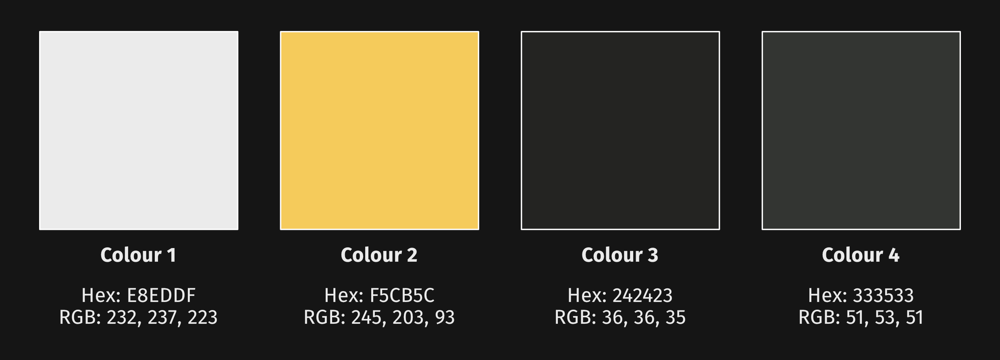

I have chosen a colour scheme that is neutral with a single pop of colour.
 -Colour 1: (Hex: E8EDDF) is an off white color and will be used for body text, the logo and navigation.
 -Colour 2: (Hex: F5CB5C) is a shad of yellow which will be used in the icon of the logo alongside the off white. It will also be used for headings and call to action buttons
 -Colour 3: (Hex: 242423) is a grey/balck that will be used as the background colour to allow the photographs to be seen true to colour and allow them to stand out from the page.
 -Colour 4: (Hex: 333533) is a lighter grey that will be used to show any layout components, such as the footer, and in the grid components to seperate information into smaller sections.

### Fonts/Typography
To ensure the website is easily readable while also keeping to the simple and minimal design, the fonts used are: Ubuntu for headings and Fira Sans for all other text (these are taken from Google Fonts library) with sans-serif being the fallback font should either of the selected fonts be unavailable. 

### Imagery
All images on the website are taken by myself and are high quality. The images give the viewer a taste of how the photographer works.

## Structure
A four page structured site that uses a combination of images and text.

## Wireframes
- [Home](docs/wireframe/home-wireframes.pdf)
- [Gallery](docs/wireframe/gallery-wireframes.pdf)
- [Projects](docs/wireframe/projects-wireframes.pdf)
- [Contact](docs/wireframe/contact-wireframes.pdf)
- [Desktop](docs/wireframe/desktop-wireframes.pdf)
- [Tablet](docs/wireframe/tablet-wireframes.pdf)
- [Mobile](docs/wireframe/mobile-wireframes.pdf)

## Technologies Used

### Languages
- [HTML5](https://en.wikipedia.org/wiki/HTML5)
- [CSS3](https://en.wikipedia.org/wiki/CSS)

### Frameworks, Libraries and Other Tools
1. [Affinity Designer](https://affinity.serif.com/en-gb/designer/) was used to create the brand logo.
2. [Affinity Photo](https://affinity.serif.com/en-gb/photo/) was used to edit and resize single images used throughout the site.
3. [Adobe Lightroom](https://www.adobe.com/uk/products/photoshop-lightroom.html?mv=search&mv=search&sdid=L7NVTQ8Y&ef_id=CjwKCAjwwqaGBhBKEiwAMk-FtO7niANG60M6gFSKzq4mI38ypFjQKDYBg1cDM0x8TBU7QUdDG22QsBoC3NMQAvD_BwE:G:s&s_kwcid=AL!3085!3!520937987408!e!!g!!adobe%20lightroom!1422699839!59976285750) was used to edit and resize images on the site. Particularly on the Gallery page where there was a large volume of images which needed to be edited and resized to the same dimensions in order to give a uniform look to the page without losing the quality of the image.
4. [Git](https://git-scm.com/) was used within VS Code for version control to push code to GitHub.
5. [Github](https://github.com/) was used as a remote repository to store code.
6. [Am I Responsive](http://ami.responsivedesign.is/) was used to create the mockup you see at the start of this README.md file
7. [Google Maps](https://www.google.co.uk/maps/@53.2525881,-3.1265367,14z) was used to embed a map with location pin into the site
8. [Coolors](https://coolors.co/) was used to help put together the colour scheme used throughout the site.
9. [Visual Studio Code](https://visualstudio.microsoft.com/) is the IDE I used to develop the project.
10. [Balsamiq](https://balsamiq.com/) was used to create the wireframes for the site
11. [Font Awesome](https://fontawesome.com/) was used for the icons throughout the site.
12. [Bootstrap v5.0.1](https://getbootstrap.com/) was used to create layout and ensure elements were responsive. The elements used include: navigation bar, carousel, accordian, modal and grid.
13. [Google Fonts](https://fonts.google.com/) Ubuntu was used for headings, while Fira Sans was used for body text.

## Features
### Common Features
There are features that appear on evey page;
#### Navigation Bar
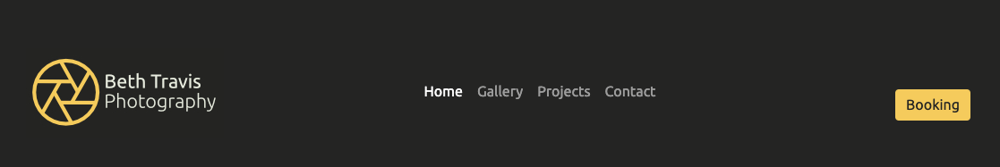

- This was designed using Bootstrap 4, it makes navigating the site simple and is clear for the user.
- At desktop size the naviagation bar all contains a call to action button which will trigger a modal encouraging the user to contact the photographer.
- The navigation bar is also fully responsive.

#### Footer
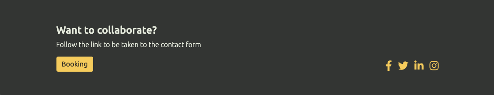

- The footer was created using Grid in Bootstrap
- The footer contains another call to action to prompt the user to ask for more information.
- It also contains links to social media in the same colours used throughout the site.

#### User stories covered by this feature:
2. As a first time visitor I want the website to be easy to use and navigate.
3. As a first time visitor I want the website to be accessible.
4. As a first time visitor I would like to look at their social media to see more of their work and any reviews.
6. As a first time visitor I would like to be able to contact the designer quickly and easily with any questions or to commission them.
8. As a returning visitor I want to be able to contact the photographer as I am interested in commissioning some work or purchasing some of their work.
10. As a site owner I want to make connections with potential new customers
11. A a site owner I want user to be able to make contact easily for opportunities, including commissions, exhibitions, events and talks.

### Feature 1 - Homepage

The homepage contains three main sections;
1. Image
2. Information about the photographers work, education and research
3. A location map to give users an idea of where the photographer is based.

The page is fully responsive on mobile and tablet.

#### 1 - Image
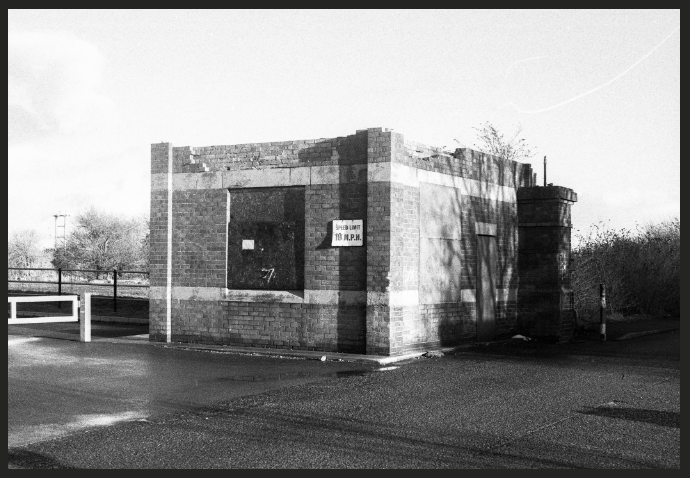

As this is the first thing a user will see on the site the image needs to be striking and also intrigue the user to make them want to see more of the work.

Like all this images used on the site this image was taken by myself.

#### 2 - About the Photographer
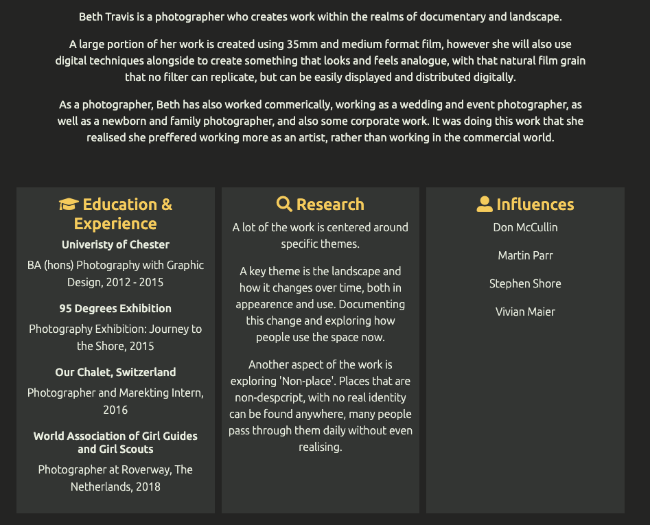

This section was created using a div with paragraph elements for the first part.

For the second part I wanted to make the information easier to read and digest. To do this I used the grid component from Bootstrap to give me three columns wich seperate the information into smaller, more manageable chunks while also being fully responsive for all screen sizes.

#### 3 - Map and location
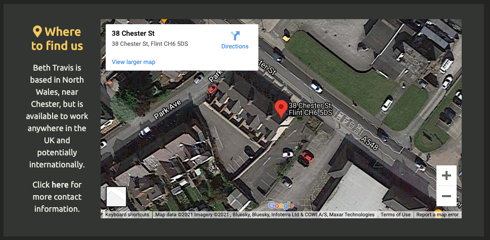

For this section I again decided to use the grid component to structure the information.

The map is embedded from Google Maps.

#### User stories covered by this feature:
1. As a first time visitor I want to know what the main aim of the website is and find out more information about the photographer.
9. As a site owner I want to show off my work to demonstrate my skill as a photographer

### Feature 2 - Gallery Page

The gallery contains two main sections;
1. Heading
2. Image gallery

#### 1 - Heading
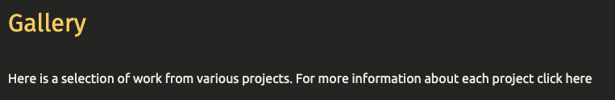

This part of the page tells the user what the page is and also tells them where to find more information using a hyperlink in the text.

#### 2 - Images
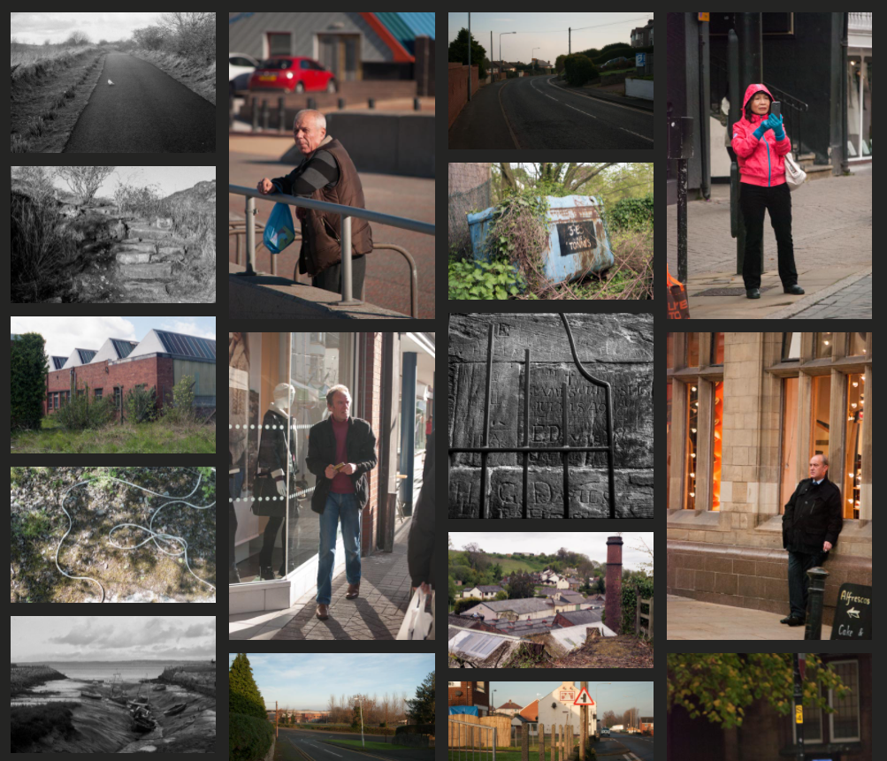

This part of the page displays a selection of images using a responsive grid, similar to how the gallery page was structured in the Love Running project from Code Institute.

The grid is responsive so the number og columns in the grid willl decrease.

Like all this images used on the site they were taken by myself.

#### User stories covered by this feature:
5. As a first time visitor I would like to know about any new projects or exhibitions that the photographer may be featured in.
7. As a returning visitor I want to be able to see any new work or updates to any work.
9. As a site owner I want to show off my work to demonstrate my skill as a photographer.

### Feature 3 - Projects Page

This page contains 4 main sections;
1. Page heading
2. Image carousel
3. Accordian
4. Other Services

#### 1 - Page Heading
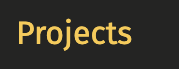

I wanted to make it easy for every user to know which page of the site they are on at all times.

I found that adding a heading to every page was the best way to do this.

#### 2 - Image Carousel
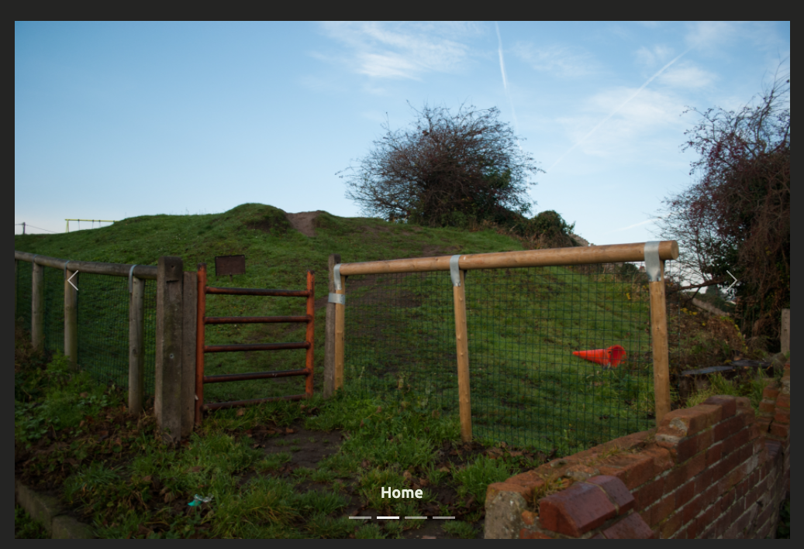

For this section I used the carousel component from Bootstrap as a way to give the users a taste of the work with their relevant project titles as the caption.

Like all this images used on the site they were taken by myself.

#### 3 - Accordian
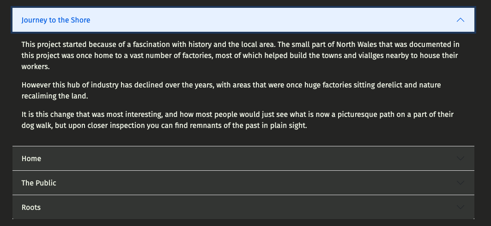

For this section I used the accordian component from Bootstrap as I wanted to keep the page design clean and simple, but not to lose any of the written content.

Each section contains information about one of the photographers projects.

#### 4 - Other Services
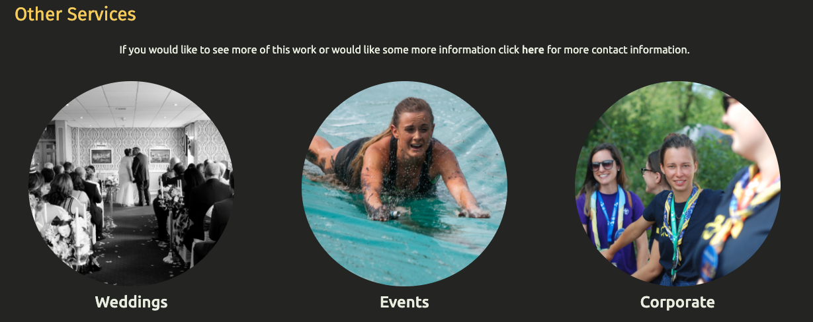

This section lists other services which are offered by the photographer, as well as another link for the user to contact the photographer.

I designed this section using a grid from Bootstrap to keep it responsive. I decided to use simple images for each service, in order to make it easy to distinguish that they are all different types of services.

Like all this images used on the site they were taken by myself.

#### User stories covered by this feature:
3. As a first time visitor I want the website to be accessible.
5. As a first time visitor I would like to know about any new projects or exhibitions that the photographer may be featured in.
6. As a first time visitor I would like to be able to contact the designer quickly and easily with any questions or to commission them.
7. As a returning visitor I want to be able to see any new work or updates to any work
8. As a returning visitor I want to be able to contact the photographer as I am interested in commissioning some work or purchasing 
some of their work.
9. As a site owner I want to show off my work to demonstrate my skill as a photographer
10. As a site owner I want to make connections with potential new customers
11. A a site owner I want user to be able to make contact easily for opportunities, including commissions, exhibitions, events and talks.

### Feature 4 - Contact Page
This page contains three main sections;
1. Image
2. Contact Information
3. Contact Form

#### 1 - Image
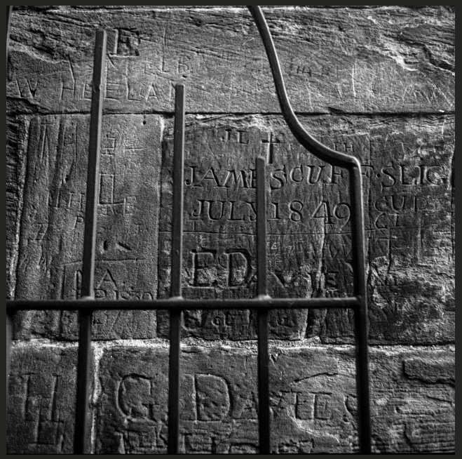
I decided to add an eyecatching image to this page to draw the user in with the smaller details within the image - this also helps keep the feel of the website contsistent between pages.

Like all this images used on the site it was taken by myself.

#### 2 - Contact Information
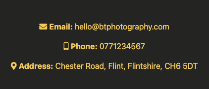

I used Font Awesome icons alongside text to keep this section simple and easy to read.

I also decided to use a brighter colour to make the details stand out from the page.

#### 3 - Form
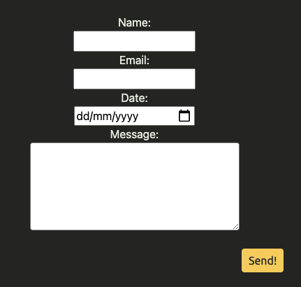

The form is fully responsive and uses the POST method. It gives users a simple way to contact the photographer directly.

All fields are set to required so it cannot be submitted until all fields are entered.

#### User stories covered by this feature:
6. As a first time visitor I would like to be able to contact the designer quickly and easily with any questions or to commission them.
8. As a returning visitor I want to be able to contact the photographer as I am interested in commissioning some work or purchasing some of their work.
10. As a site owner I want to make connections with potential new customers
11. A a site owner I want user to be able to make contact easily for opportunities, including commissions, exhibitions, events and talks.

### Feature 5 - Booking Modal
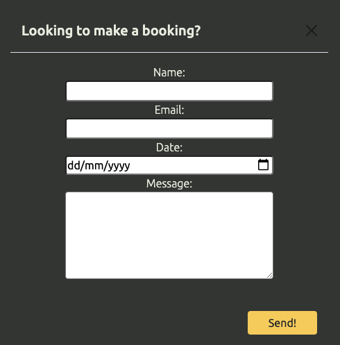

The modal opens when the user clicks on the 'Booking' button in the navigation bar, or in the footer.

For more information about the form please see feature 4, part 3.

#### User stories covered by this feature:
6. As a first time visitor I would like to be able to contact the designer quickly and easily with any questions or to commission them.
8. As a returning visitor I want to be able to contact the photographer as I am interested in commissioning some work or purchasing some of their work.
10. As a site owner I want to make connections with potential new customers
11. A a site owner I want user to be able to make contact easily for opportunities, including commissions, exhibitions, events and talks.

## Validation and Testing

### HTML Validation
I used the - [W3C Markup Validation Service](https://validator.w3.org/) to validate the HTML of the website. All pages passed with 0 errors and 0 warnings.

Click on the page name to see the result:

- [Home](docs/validation/html/html-validation-index.png)
- [Gallery](docs/validation/html/html-validation-gallery.png)
- [Projects](docs/validation/html/html-validation-projects.png)
- [Contact](docs/validation/html/html-validation-contact.png)
- [404](docs/validation/html/html-validation-404.png)

------Validation
EXPLAIN
------Testing of User Stories(Feature-Action-Expected result-Actual result)
EXPLAIN
------Bugs
EXPLAIN
------Deployment
EXPLAIN
------Credit
EXPLAIN
-----Acknowledgements
EXPLAIN