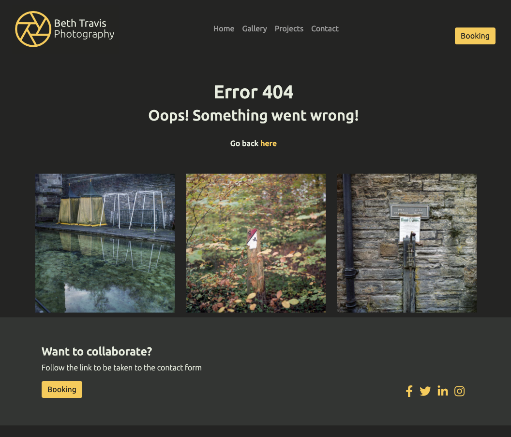

#   

[View the deployed site here](https://beth-t93.github.io/ci_ms1_btphotography/)

## Table of Contents

- [Project Goals](#project-goals)
- [User Experience](#user-experience)
    - [User Goals](#user-goals)
    - [Target Audience](#target-audience)
    - [User Stories](#user-stories)
    - [User Requirments and Expectations](user-requirements-and-expectations)
- [Design Choices](#design-choices)
    - [Colours](#colours)
    - [Fonts/Typography](#fonts-typography)
    - [Imagery](#imagery)
- [Structure](#structure)
- [Wireframes](#wireframes)
- [Technologies Used](#technologies-used)
    - [Languages](#languages)
    - [Frameworks, Librabries and Other Tools](#frameworks-libraries-and-other-tools)
- [Features](#features)
- [Validation and Testing](#vlaidation-and-testing)
    - [HTML Validation](#html-validation)
    - [CSS Validation](#css-validation)
    - [Acessibility](#accessibility)
    - [Performance](#performance)
    - [Testing on Other Devices](#testing-on-other-devices)
    - [Testing of User Stories](#testing-of-user-stories)
- [Bugs](#bugs)
- [Deployment](#deployment)
- [Credits](#credits)
- [Acknowledgements](Acknowledgements)

## Project Goals
The aim of this project is to create a portfolio website to showcase my own photography work in a way that is both appealing and accessible across a range of devices and screen sizes.

## User Experience
### User Goals
An easy to use website
A way to contact the photographer directly
Key details, such as contact details and location are easy to find
Easy to find examples of the photographers work and any projects they are working on
Information should be current and up to date

### Target Audience
- Other artists
- People who like photography and would like to find out more about a body of work
- Students who are researching other photographers for their work
### User Stories
#### First Time Visitor Goals
1. As a first time visitor I want to know what the main aim of the website is and find out more information about the photographer,
2. As a first time visitor I want the website to be easy to use and navigate.
3. As a first time visitor I want the website to be accessible.
4. As a first time visitor I would like to look at their social media to see more of their work and any reviews.
5. As a first time visitor I would like to know about any new projects or exhibitions that the photographer may be featured in.
6. As a first time visitor I would like to be able to contact the photographer quickly and easily with any questions or to commission them.

#### Returning Visitor Goals
7. As a returning visitor I want to be able to see any new work or updates to any work
8. As a returning visitor I want to be able to contact the photographer as I am interested in commissioning some work or purchasing some of their work.

#### Site Owner Goals
9. As a site owner I want to show off my work to demonstrate my skill as a photographer
10. As a site owner I want to make connections with potential new customers
11. A a site owner I want user to be able to make contact easily for opportunities, including commissions, exhibitions, events and talks.

### User Requirements and Expectations
#### Requirements
- Easy to navigate using the menu
- Appealing imagery and design
- Relevant information to accompany the images
- Easy way to contact the photographer
- Clean design that allows the images to be the main attraction to the website

#### Expectations
- The navigation links take you to the page they say they will
- Social media links will open in a separate tab
- When using the contact button all fields will be required before being able to send the message
- Lots of images to showcase the photographers work

## Design Choices
The style of the site will be simple and minimal in order to let the photographs themselves do the work to attract users, however the website will still be accessible and easy to navigate.

### Colours
The colour scheme from this website comes from the photographers work, they make their best work while outside exploring the landscape. The colours will work together in a way that lets the images stand out, while also providing a neutral backdrop to view the photographs on.

I have chosen a colour scheme that is neutral with a single pop of colour.
 -Colour 1: (Hex: E8EDDF) is an off white color and will be used for body text, the logo and navigation.
 -Colour 2: (Hex: F5CB5C) is a shad of yellow which will be used in the icon of the logo alongside the off white. It will also be used for headings and call to action buttons
 -Colour 3: (Hex: 242423) is a grey/balck that will be used as the background colour to allow the photographs to be seen true to colour and allow them to stand out from the page.
 -Colour 4: (Hex: 333533) is a lighter grey that will be used to show any layout components, such as the footer, and in the grid components to seperate information into smaller sections.

### Fonts/Typography
To ensure the website is easily readable while also keeping to the simple and minimal design, the fonts used are: Ubuntu for headings and Fira Sans for all other text (these are taken from Google Fonts library) with sans-serif being the fallback font should either of the selected fonts be unavailable. 

### Imagery
All images on the website are taken by myself and are high quality. The images give the viewer a taste of how the photographer works.

## Structure
A four page structured site that uses a combination of images and text.

## Wireframes
- [Home](docs/wireframe/home-wireframes.pdf)
- [Gallery](docs/wireframe/gallery-wireframes.pdf)
- [Projects](docs/wireframe/projects-wireframes.pdf)
- [Contact](docs/wireframe/contact-wireframes.pdf)
- [Desktop](docs/wireframe/desktop-wireframes.pdf)
- [Tablet](docs/wireframe/tablet-wireframes.pdf)
- [Mobile](docs/wireframe/mobile-wireframes.pdf)

## Technologies Used

### Languages
- [HTML5](https://en.wikipedia.org/wiki/HTML5)
- [CSS3](https://en.wikipedia.org/wiki/CSS)

### Frameworks, Libraries and Other Tools
1. [Affinity Designer](https://affinity.serif.com/en-gb/designer/) was used to create the brand logo.
2. [Affinity Photo](https://affinity.serif.com/en-gb/photo/) was used to edit and resize single images used throughout the site.
3. [Adobe Lightroom](https://www.adobe.com/uk/products/photoshop-lightroom.html?mv=search&mv=search&sdid=L7NVTQ8Y&ef_id=CjwKCAjwwqaGBhBKEiwAMk-FtO7niANG60M6gFSKzq4mI38ypFjQKDYBg1cDM0x8TBU7QUdDG22QsBoC3NMQAvD_BwE:G:s&s_kwcid=AL!3085!3!520937987408!e!!g!!adobe%20lightroom!1422699839!59976285750) was used to edit and resize images on the site. Particularly on the Gallery page where there was a large volume of images which needed to be edited and resized to the same dimensions in order to give a uniform look to the page without losing the quality of the image.
4. [Git](https://git-scm.com/) was used within VS Code for version control to push code to GitHub.
5. [Github](https://github.com/) was used as a remote repository to store code.
6. [Am I Responsive](http://ami.responsivedesign.is/) was used to create the mockup you see at the start of this README.md file
7. [Google Maps](https://www.google.co.uk/maps/@53.2525881,-3.1265367,14z) was used to embed a map with location pin into the site
8. [Coolors](https://coolors.co/) was used to help put together the colour scheme used throughout the site.
9. [Visual Studio Code](https://visualstudio.microsoft.com/) is the IDE I used to develop the project.
10. [Balsamiq](https://balsamiq.com/) was used to create the wireframes for the site
11. [Font Awesome](https://fontawesome.com/) was used for the icons throughout the site.
12. [Bootstrap v5.0.1](https://getbootstrap.com/) was used to create layout and ensure elements were responsive. The elements used include: navigation bar, carousel, accordian, modal and grid.
13. [Google Fonts](https://fonts.google.com/) Ubuntu was used for headings, while Fira Sans was used for body text.

## Features
### Common Features
There are features that appear on evey page;
#### Navigation Bar

- This was designed using Bootstrap 4, it makes navigating the site simple and is clear for the user.
- At desktop size the naviagation bar all contains a call to action button which will trigger a modal encouraging the user to contact the photographer.
- The navigation bar is also fully responsive.

#### Footer

- The footer was created using Grid in Bootstrap
- The footer contains another call to action to prompt the user to ask for more information.
- It also contains links to social media in the same colours used throughout the site.

#### User stories covered by this feature:
2. As a first time visitor I want the website to be easy to use and navigate.
3. As a first time visitor I want the website to be accessible.
4. As a first time visitor I would like to look at their social media to see more of their work and any reviews.
6. As a first time visitor I would like to be able to contact the designer quickly and easily with any questions or to commission them.
8. As a returning visitor I want to be able to contact the photographer as I am interested in commissioning some work or purchasing some of their work.
10. As a site owner I want to make connections with potential new customers
11. A a site owner I want user to be able to make contact easily for opportunities, including commissions, exhibitions, events and talks.

### Feature 1 - Homepage

The homepage contains three main sections;
1. Image
2. Information about the photographers work, education and research
3. A location map to give users an idea of where the photographer is based.

The page is fully responsive on mobile and tablet.

#### 1 - Image

As this is the first thing a user will see on the site the image needs to be striking and also intrigue the user to make them want to see more of the work.

Like all this images used on the site this image was taken by myself.

#### 2 - About the Photographer

This section was created using a div with paragraph elements for the first part.

For the second part I wanted to make the information easier to read and digest. To do this I used the grid component from Bootstrap to give me three columns wich seperate the information into smaller, more manageable chunks while also being fully responsive for all screen sizes.

#### 3 - Map and location

For this section I again decided to use the grid component to structure the information.

The map is embedded from Google Maps.

#### User stories covered by this feature:
1. As a first time visitor I want to know what the main aim of the website is and find out more information about the photographer.
9. As a site owner I want to show off my work to demonstrate my skill as a photographer

### Feature 2 - Gallery Page

The gallery contains two main sections;
1. Heading
2. Image gallery

#### 1 - Heading

This part of the page tells the user what the page is and also tells them where to find more information using a hyperlink in the text.

#### 2 - Images

This part of the page displays a selection of images using a responsive grid, similar to how the gallery page was structured in the Love Running project from Code Institute.

The grid is responsive so the number og columns in the grid willl decrease.

Like all this images used on the site they were taken by myself.

#### User stories covered by this feature:
5. As a first time visitor I would like to know about any new projects or exhibitions that the photographer may be featured in.
7. As a returning visitor I want to be able to see any new work or updates to any work.
9. As a site owner I want to show off my work to demonstrate my skill as a photographer.

### Feature 3 - Projects Page

This page contains 4 main sections;
1. Page heading
2. Image carousel
3. Accordian
4. Other Services

#### 1 - Page Heading

I wanted to make it easy for every user to know which page of the site they are on at all times.

I found that adding a heading to every page was the best way to do this.

#### 2 - Image Carousel

For this section I used the carousel component from Bootstrap as a way to give the users a taste of the work with their relevant project titles as the caption.

Like all this images used on the site they were taken by myself.

#### 3 - Accordian

For this section I used the accordian component from Bootstrap as I wanted to keep the page design clean and simple, but not to lose any of the written content.

Each section contains information about one of the photographers projects.

#### 4 - Other Services

This section lists other services which are offered by the photographer, as well as another link for the user to contact the photographer.

I designed this section using a grid from Bootstrap to keep it responsive. I decided to use simple images for each service, in order to make it easy to distinguish that they are all different types of services.

Like all this images used on the site they were taken by myself.

#### User stories covered by this feature:
3. As a first time visitor I want the website to be accessible.
5. As a first time visitor I would like to know about any new projects or exhibitions that the photographer may be featured in.
6. As a first time visitor I would like to be able to contact the designer quickly and easily with any questions or to commission them.
7. As a returning visitor I want to be able to see any new work or updates to any work
8. As a returning visitor I want to be able to contact the photographer as I am interested in commissioning some work or purchasing 
some of their work.
9. As a site owner I want to show off my work to demonstrate my skill as a photographer
10. As a site owner I want to make connections with potential new customers
11. A a site owner I want user to be able to make contact easily for opportunities, including commissions, exhibitions, events and talks.

### Feature 4 - Contact Page
This page contains three main sections;
1. Image
2. Contact Information
3. Contact Form

#### 1 - Image

I decided to add an eyecatching image to this page to draw the user in with the smaller details within the image - this also helps keep the feel of the website contsistent between pages.

Like all this images used on the site it was taken by myself.

#### 2 - Contact Information

I used Font Awesome icons alongside text to keep this section simple and easy to read.

I also decided to use a brighter colour to make the details stand out from the page.

#### 3 - Form

The form is fully responsive and uses the POST method. It gives users a simple way to contact the photographer directly.

All fields are set to required so it cannot be submitted until all fields are entered.

#### User stories covered by this feature:
6. As a first time visitor I would like to be able to contact the designer quickly and easily with any questions or to commission them.
8. As a returning visitor I want to be able to contact the photographer as I am interested in commissioning some work or purchasing some of their work.
10. As a site owner I want to make connections with potential new customers
11. A a site owner I want user to be able to make contact easily for opportunities, including commissions, exhibitions, events and talks.

### Feature 5 - Booking Modal

The modal opens when the user clicks on the 'Booking' button in the navigation bar, or in the footer.

For more information about the form please see feature 4, part 3.

#### User stories covered by this feature:
6. As a first time visitor I would like to be able to contact the designer quickly and easily with any questions or to commission them.
8. As a returning visitor I want to be able to contact the photographer as I am interested in commissioning some work or purchasing some of their work.
10. As a site owner I want to make connections with potential new customers
11. A a site owner I want user to be able to make contact easily for opportunities, including commissions, exhibitions, events and talks.

### Feature 6 - 404 Error Page
  

This page will appear whenever a page cannot be reached. It gives users a simple way to return to the page they came from without using the browser back button.

#### User stories covered by this feature:
2. As a first time visitor I want the website to be easy to use and navigate.
3. As a first time visitor I want the website to be accessible.

## Validation and Testing

### HTML Validation
I used the [W3C Markup Validation Service](https://validator.w3.org/) to validate the HTML of the website. All pages passed with 0 errors and 0 warnings.

Click on the page name to see the result:

- [Home](docs/validation/html/html-validation-index.png)
- [Gallery](docs/validation/html/html-validation-gallery.png)
- [Projects](docs/validation/html/html-validation-projects.png)
- [Contact](docs/validation/html/html-validation-contact.png)
- [404](docs/validation/html/html-validation-404.png)

### CSS Validation
I used the [W3C CSS Validation Service](https://jigsaw.w3.org/css-validator/) to validate the CSS of the website.

[The CSS](docs/validation/css/css-validation.png) contained errors with third party code, but 0 errors with code I had written.

### Accessibility
I used the [WAVE Web Accessibility Evaluation Tool](https://wave.webaim.org/) to check that my website was accessible.

All pages contained 0 errors.

Click on the page name to see the result:

- [Home](docs/validation/acessibility/WAVE-index.png)
- [Gallery](docs/validation/acessibility/WAVE-gallery.png)
- [Projects](docs/validation/acessibility/WAVE-projects.png)
- [Contact](docs/validation/acessibility/WAVE-contact.png)
- [404](docs/validation/acessibility/WAVE-404.png)

### Performance
I used [Google Lighthouse](https://developers.google.com/web/tools/lighthouse) to measure the performance and speed of my website.

All pages passed with at least 91% on performance, at least 96% (The gallery, projects and 404 page socred 100%) on accessibility, 93% on best practices and  at least 92% (The contact page socred 100%) on SEO,

Click on the page name to see the result:

- [Home](docs/validation/lighthouse/lighthouse-index.png)
- [Gallery](docs/validation/lighthouse/lighthouse-gallery.png)
- [Projects](docs/validation/lighthouse/lighthouse-projects.png)
- [Contact](docs/validation/lighthouse/lighthouse-contact.png)
- [404](docs/validation/lighthouse/lighthouse-404.png)

### Testing on other devices

#### Devices tested:
- iPhone 12 Pro
- Samsung s20+
- iPad Pro 11"
- 21.5" iMac
- Asus Chromebook Flip C434TA

#### Browser Testing
- Chrome
- Brave (Chromium)
- Edge
- Safari

#### Tests Performed
- The navigation bar successfully directs users to the correct page with no broken links
- Internal and external links direct users to the correct page with no broken links
- The logo directs users back to the home page from all pages.
- The booking modal opens and closes correctly.
- The booking modal button does not display in mobile view to make the website easier to use and navigate on mobile.
- The form on the modal and on the contact page will not submit unless all fields are filled out.
- The text on the homepage is fully responsive so can be read easily on any screen size.
- The map has a location pin showing the user where the photographer is based
- The image grid on the gallery page is responsive making it easy for user to look at the images at all screen sizes
- All elements on the projects page are easy to read and navigate on all screen sizes.
- All copy text on the site is clear and legible.
- Should an error occur users are taken to a 404 page where they can easily naviagate back to other pages on the site.
- Images on the site scale with the screen size so there is no horizontal scrolling to view a full image.

#### Results
All devices passed the tests.

### Testing of User Stories

1. As a first time visitor I want to know what the main aim of the website is and find out more information about the photographer,

| Feature | Action | Expected Result | Actual Result |
| --- | ----------- | --- | ----------- | 
| Information about the photographer on the homepage | Scroll down | To find the photographers information on the home page | Works as expected |

[Screenshot](docs/testing/user-story-1.png)

2. As a first time visitor I want the website to be easy to use and navigate.

| Feature | Action | Expected Result | Actual Result |
| --- | ----------- | --- | ----------- |
| Simple, easy to navigate design | User can easily see all the possible paths clearly | User successfully finds what they were looking for on the site | Works as expected |

[Screenshot](docs/testing/user-story-2.png)

3. As a first time visitor I want the website to be accessible.

| Feature | Action | Expected Result | Actual Result |
| --- | ----------- | --- | ----------- |
|Responsive simple design | Site can be viewed on desktop, tablet and mobile with no issues | The site changes in response to the display size to give all users a good user experience | Works as expected |
| High contrast colour scheme | All text on the site is in a contrasting colour to the background | Users are able to clearly read all text | Works as expected |
| alt tags on all images | Screen reader users are able to know what each image is of | All images have an alt tag | Works as expected |

[Screenshot](docs/testing/user-story-3.png)

4. As a first time visitor I would like to look at their social media to see more of their work and any reviews.

| Feature | Action | Expected Result | Actual Result |
| --- | ----------- | --- | ----------- |
| Social icons in the footer of all pages | Scroll to bottom of page | See the social mesdia incons to the right of the footer | Works as expected |

[Screenshot](docs/testing/user-story-4.png)

5. As a first time visitor I would like to know about any new projects or exhibitions that the photographer may be featured in.

| Feature | Action | Expected Result | Actual Result |
| --- | ----------- | --- | ----------- |
| Projects and Gallery Pages | Navigate to the projects or gallery pages in the naviagation bar | To be taken to the specific page you clicked the link for | Works as expected |

[Screenshot](docs/testing/user-story-5-7-9.png)

6. As a first time visitor I would like to be able to contact the photographer quickly and easily with any questions or to commission them.

| Feature | Action | Expected Result | Actual Result |
| --- | ----------- | --- | ----------- |
| Booking Modal | Click the 'Booking' button in the header or footer | A modal with a contact form will show on the page | Works as expected |
| Contact Page | Use either the contact form or use the contact details listed | Easily contact the photographer | Works as expected |

[Screenshot](docs/testing/user-story-6-8-10-11.png)

7. As a returning visitor I want to be able to see any new work or updates to any work

| Feature | Action | Expected Result | Actual Result |
| --- | ----------- | --- | ----------- |
| Projects Page | Navigate to Projects using the navigation bar | To be taken to the projects page | Works as expected |
| Social media links | Navigate to the phtoographers social media using the links in the footer | Be taken to the relevant social media page | Works as expected |

[Screenshot](docs/testing/user-story-5-7-9.png)

8. As a returning visitor I want to be able to contact the photographer as I am interested in commissioning some work or purchasing some of their work.

| Feature | Action | Expected Result | Actual Result |
| --- | ----------- | --- | ----------- |
| Booking Modal | Click the 'Booking' button in the header or footer | A modal with a contact form will show on the page | Works as expected |
| Contact Page | Use either the contact form or use the contact details listed | Easily contact the photographer | Works as expected |

[Screenshot](docs/testing/user-story-6-8-10-11.png)

9. As a site owner I want to show off my work to demonstrate my skill as a photographer

| Feature | Action | Expected Result | Actual Result |
| --- | ----------- | --- | ----------- |
| Gallery and Projects Pages | Upload work to the gallery and projects page | Both pages contain up to date work and project information | Works as expected |

[Screenshot](docs/testing/user-story-5-7-9.png)

10. As a site owner I want to make connections with potential new customers

| Feature | Action | Expected Result | Actual Result |
| --- | ----------- | --- | ----------- |
| Contact and booking links | Make all relevant buttons and links stand out so users can see them clearly | Set all colours and text weights to stand out from the surrounding content, make used of the hover state to change text colour | Works as expected |

[Screenshot](docs/testing/user-story-6-8-10-11.png)

11. A a site owner I want user to be able to make contact easily for opportunities, including commissions, exhibitions, events and talks.

| Feature | Action | Expected Result | Actual Result |
| --- | ----------- | --- | ----------- |
| Contact and booking links | Make all relevant buttons and links stand out so users can see them clearly | Set all colours and text weights to stand out from the surrounding content, make used of the hover state to change text colour | Works as expected |

[Screenshot](docs/testing/user-story-6-8-10-11.png)

## Bugs

- Bug: Google Map would overflow the side of the page in mobile and tablet.
- Fix: Used [a blog post on Duda](https://blog.duda.co/responsive-google-maps-for-your-website) to help which told me to set width to 100% rather than fixed number as it said on Google Maps embedding instructions.

- Bug: Footer would display too wide with horizontal scroll in mobile view.
- Fix: The width had been set to 110% so I changed this to 100% instead.

- Bug: Images on the gallery page were not responsive.
- Fix: used the class 'img-fluid' from Bootstrap.

- Bug: Modal was not necessary in mobile view, but the button would still display in the header and footer.
- Fix: Used [Stack Overflow](https://stackoverflow.com/questions/36637802/how-to-hide-bootstrap-modal-in-mobile) to go through display characteristic in CSS.

- Bug: Test area in form would overflow the page and modal on smaller displays
- Fix: Used [Stack Overflow](https://stackoverflow.com/questions/39068128/how-can-i-make-a-textarea-that-fits-within-the-width-of-the-current-viewport/39068155) to go through setting the max width and div set up of the form.

- Bug: Internal links were not working on mobile devices.
- Fix: Checked and retyped the internal links without /.

- Bug: Favicon would not load on all pages.
- Fix: Checked [Favicon](https://favicon.io/tutorials/how-to-add-a-favicon-to-a-website-png-format/) instructions again.

- Bug: WAVE contrast error for social media icons alt text
- Fix: Set the colour of the alt text in CSS to the same colour as the icons.

## Deployment

### Github Pages
This site is deployed using GitHub pages, this was the process:
1. Log in and selected my MS1 repository
2. Go to settings in the repository
3. Go to 'Pages" in the menu
4. Click 'source'
5. Change to dropdown menu from 'none' to 'main'
6. Click the link to the delpoyed site once the page has reloaded

### Forking this Repository
1. Find the repository on GitHub
2. Click the 'Fork' button on the top right of the page
3. You will now have a copy of the repository on your Github account

### Cloning this Repository
1. Find the repository on Github
2. Click on 'Code'
3. To clone using HTTPS - copy the url
4. Open Git and go to the directory you want to become the cloned directory
5. In the terminal type 'git clone' and the url
6. Press enter for the clone to be created.

## Credits
### Content and Media
- The copy for this website was written by myself
- All of the images used on the site were taken by myself

### Code
- [Bootstrap:](https://getbootstrap.com/) for:
    - Carousel
    - Accordian
    - Grid
    - Navigation bar
- [Stack Overflow](https://stackoverflow.com/questions/39068128/how-can-i-make-a-textarea-that-fits-within-the-width-of-the-current-viewport/39068155) for help with making text fields responsive, and using diplay in CSS.
- Code Institue - for creating the layout of the gallery images, inspired by the Love Running Mini Project.
- [W3 Schools](https://www.w3schools.com/howto/howto_css_three_columns.asp) for help setting up a three column grid
- [Web.dev](https://web.dev/meta-description/?utm_source=lighthouse&utm_medium=devtools) for help with setting up a meta description after Lighthouse testing.
- [HTML Dog](https://www.htmldog.com/techniques/404/) for help adding a 404 error page to the site.

## Acknowledgements
- My mentor Mo Shami for his suppot, advice and feedback.
- My partner for all his support and testing feedback.
- The slack community for all the helpful advice and guidance.
